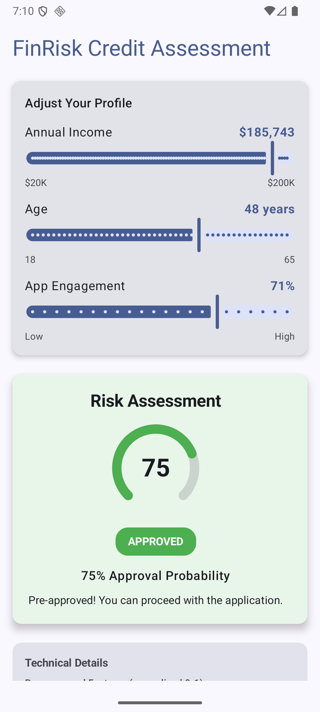
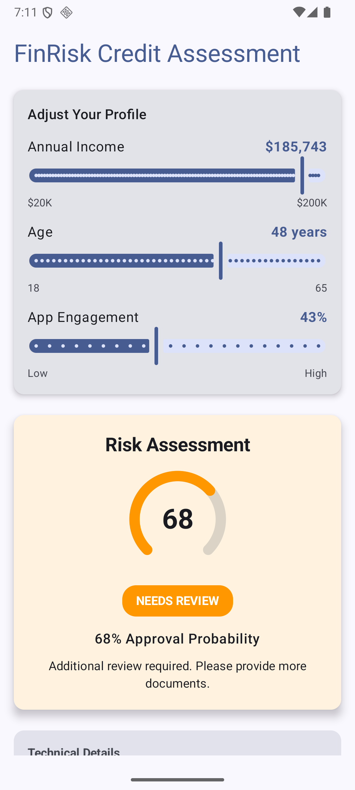
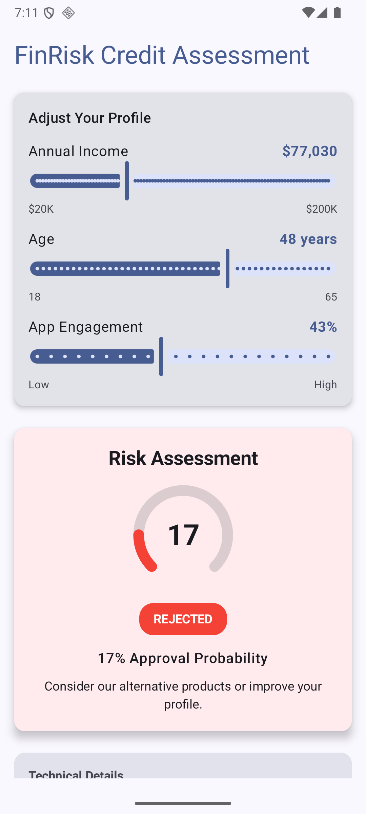

# FinRisk - Credit Risk Assessment App

An Android application that uses on-device machine learning to assess credit risk in real-time. Users can adjust their financial profile and instantly see their loan approval probability.

## Features

- **Real-time ML Inference**: On-device TensorFlow Lite model for instant predictions
- **Interactive UI**: Sliders for income, age, and app engagement
- **Visual Feedback**: Animated gauge and color-coded decision badges
- **Technical Transparency**: Shows preprocessed features and inference time
- **Offline Capable**: No network required - all inference runs locally

## Screenshots

<p align="center">
  
  
  
</p>

<p align="center">
  <em>Left: Approved (≥70%) | Center: Review (40-70%) | Right: Rejected (<40%)</em>
</p>

## Architecture

The app follows **Clean Architecture** principles with clear separation of concerns:

```
┌─────────────────────────────────────────────────────────────┐
│  PRESENTATION LAYER                                         │
│  ├── ui/          Compose screens & components              │
│  └── viewmodel/   State management & UI logic               │
├─────────────────────────────────────────────────────────────┤
│  DOMAIN LAYER                                               │
│  ├── model/       Business entities (RiskResult, Decision)  │
│  └── classifier/  RiskClassifier interface                  │
├─────────────────────────────────────────────────────────────┤
│  DATA LAYER                                                 │
│  └── ml/          LiteRT/TFLite implementation              │
├─────────────────────────────────────────────────────────────┤
│  DI LAYER                                                   │
│  └── di/          Hilt modules                              │
└─────────────────────────────────────────────────────────────┘
```

### Data Flow

```
User Input → ViewModel → Preprocessing → ML Inference → RiskResult → UI Update
```

1. User adjusts slider (income/age/engagement)
2. ViewModel normalizes inputs to 0-1 range
3. Normalized features sent to RiskClassifier
4. LiteRT runs inference on TFLite model
5. Result mapped to business decision (Approved/Review/Rejected)
6. UI recomposes with new state

## Tech Stack

| Category | Technology |
|----------|------------|
| Language | Kotlin 2.0.21 |
| UI | Jetpack Compose + Material 3 |
| DI | Hilt 2.56.1 with KSP |
| ML | LiteRT (TensorFlow Lite) 1.0.1 |
| Async | Kotlin Coroutines |
| Build | Gradle 9.0.0 (AGP) |
| Min SDK | 24 (Android 7.0) |
| Target SDK | 36 |

## Project Structure

```
app/src/main/
├── java/com/ai/finrisk/
│   ├── FinRiskApplication.kt       # Hilt application entry point
│   ├── di/
│   │   └── MlModule.kt             # Hilt bindings for ML
│   ├── domain/
│   │   ├── classifier/
│   │   │   └── RiskClassifier.kt   # ML interface
│   │   └── model/
│   │       ├── RiskDecision.kt     # Enum: APPROVED/REVIEW/REJECTED
│   │       └── RiskResult.kt       # ML result with probability
│   ├── data/
│   │   └── ml/
│   │       └── LiteRtRiskClassifier.kt  # TFLite implementation
│   └── presentation/
│       ├── ui/
│       │   ├── MainActivity.kt
│       │   ├── RiskAssessmentScreen.kt
│       │   └── components/
│       │       ├── Sliders.kt
│       │       ├── RiskResultCard.kt
│       │       └── TechnicalDetailsCard.kt
│       └── viewmodel/
│           ├── RiskAssessmentViewModel.kt
│           └── RiskAssessmentUiState.kt
├── assets/
│   └── finrisk_classifier.tflite   # ML model
└── res/
    └── ...

ml-pipeline/                         # Model training (not part of APK)
├── models/
│   └── finrisk_classifier.tflite
└── training_simple.py
```

## ML Model

### Model Details

| Property | Value |
|----------|-------|
| Framework | TensorFlow Lite |
| Type | Logistic Regression |
| Input Shape | [1, 3] float32 |
| Output Shape | [1, 1] float32 |
| Size | ~2 KB |

### Input Features (normalized 0-1)

| Index | Feature | Raw Range | Normalization |
|-------|---------|-----------|---------------|
| 0 | Income | $20K - $200K | (x - 20000) / 180000 |
| 1 | Age | 18 - 65 years | (x - 18) / 47 |
| 2 | Engagement | 0% - 100% | Already 0-1 |

### Decision Thresholds

| Probability | Decision |
|-------------|----------|
| >= 70% | APPROVED |
| >= 40% | REVIEW |
| < 40% | REJECTED |

## Getting Started

### Prerequisites

- Android Studio Ladybug (2024.2.1) or newer
- JDK 17
- Android SDK 36

### Build & Run

```bash
# Clone the repository
git clone https://github.com/yourusername/FinRisk.git
cd FinRisk

# Build debug APK
./gradlew assembleDebug

# Install on connected device
./gradlew installDebug
```

### Run Tests

```bash
# Unit tests
./gradlew test

# Instrumented tests
./gradlew connectedAndroidTest
```

## Configuration

### Gradle Version Catalog

Dependencies are in `gradle/libs.versions.toml`:

```toml
[versions]
kotlin = "2.0.21"
hilt = "2.56.1"
litert = "1.0.1"
composeBom = "2024.09.00"
```

### Hilt Setup

The app uses KSP (not kapt) for annotation processing:

```kotlin
// build.gradle.kts (app)
plugins {
    alias(libs.plugins.ksp)
    alias(libs.plugins.hilt.android)
}

dependencies {
    implementation(libs.hilt.android)
    implementation(libs.hilt.navigation.compose)
    ksp(libs.hilt.compiler)
}
```

## Known Limitations

- **GPU Acceleration**: Disabled due to LiteRT namespace conflicts with AGP 9.0
- **Model Updates**: Model is bundled in assets; no OTA updates

## Future Improvements

- [ ] Add unit tests for ViewModel and Classifier
- [ ] Implement model versioning and remote updates
- [ ] Add more input features (credit history, debt ratio)
- [ ] Support dark theme
- [ ] Add localization

## License

```
MIT License

Copyright (c) 2024

Permission is hereby granted, free of charge, to any person obtaining a copy
of this software and associated documentation files (the "Software"), to deal
in the Software without restriction, including without limitation the rights
to use, copy, modify, merge, publish, distribute, sublicense, and/or sell
copies of the Software, and to permit persons to whom the Software is
furnished to do so, subject to the following conditions:

The above copyright notice and this permission notice shall be included in all
copies or substantial portions of the Software.

THE SOFTWARE IS PROVIDED "AS IS", WITHOUT WARRANTY OF ANY KIND, EXPRESS OR
IMPLIED, INCLUDING BUT NOT LIMITED TO THE WARRANTIES OF MERCHANTABILITY,
FITNESS FOR A PARTICULAR PURPOSE AND NONINFRINGEMENT. IN NO EVENT SHALL THE
AUTHORS OR COPYRIGHT HOLDERS BE LIABLE FOR ANY CLAIM, DAMAGES OR OTHER
LIABILITY, WHETHER IN AN ACTION OF CONTRACT, TORT OR OTHERWISE, ARISING FROM,
OUT OF OR IN CONNECTION WITH THE SOFTWARE OR THE USE OR OTHER DEALINGS IN THE
SOFTWARE.
```
