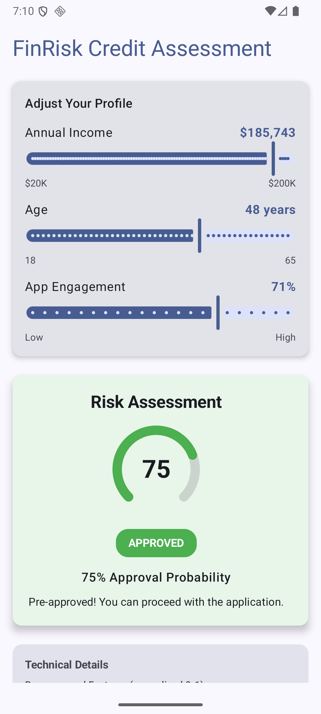
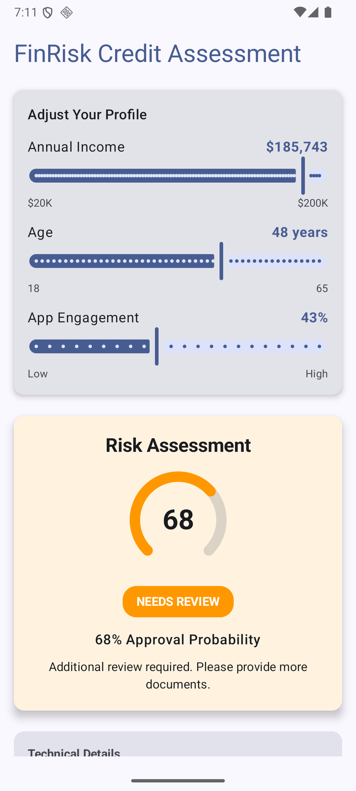
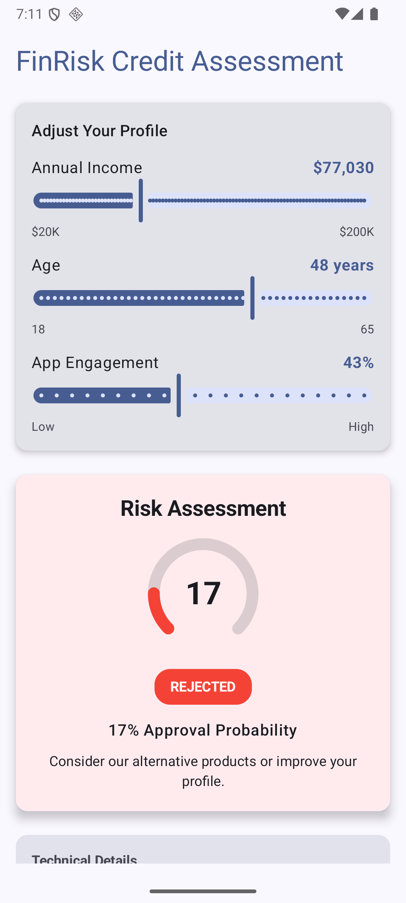

# FinRisk - Credit Risk Assessment App

An Android application that uses on-device machine learning to assess credit risk in real-time. Built as the companion project for [**Machine Learning for Android Engineers**](https://vortanasay.gumroad.com/) — from theory to on-device inference.

## Features

- **Real-time ML Inference**: On-device TensorFlow Lite model for instant predictions
- **Interactive UI**: Sliders for income, debt ratio, and credit score
- **Visual Feedback**: Animated gauge and color-coded decision badges
- **Technical Transparency**: Shows preprocessed features and inference time
- **Offline Capable**: No network required — all inference runs locally
- **Production-Ready**: Kill switch, fallback classifier, crash reporting, and analytics infrastructure

## Screenshots

| Approved (≥60%) | Review (40-60%) | Rejected (<40%) |
|:---:|:---:|:---:|
|  |  |  |

## About the Book

FinRisk is built step-by-step across three chapters of *Machine Learning for Android Engineers*:

| Chapter | What Happens | Model |
|---------|-------------|-------|
| **Ch 4 — Building FinRisk** | End-to-end pipeline: training in Python, conversion to TFLite, inference in Kotlin | Logistic Regression (~1.8 KB) |
| **Ch 5 — Upgrading to a Neural Network** | Replace logistic regression with a 1-hidden-layer network to learn feature interactions | Neural Network |
| **Ch 6 — Making It Production-Ready** | ProGuard rules, testing, error handling, monitoring, kill switch, fallback classifier | Same model, hardened |

The app's architecture is deliberately designed so that **swapping models requires zero Android code changes** — the `RiskClassifier` interface absorbs upgrades cleanly.

## Architecture

The app follows **Clean Architecture** with clear separation of concerns:

```
┌─────────────────────────────────────────────────────────────┐
│  PRESENTATION LAYER                                         │
│  ├── ui/          Compose screens & components              │
│  └── viewmodel/   State management & UI logic               │
├─────────────────────────────────────────────────────────────┤
│  DOMAIN LAYER                                               │
│  ├── model/       Business entities (RiskResult, Decision)  │
│  └── classifier/  RiskClassifier interface                  │
├─────────────────────────────────────────────────────────────┤
│  DATA LAYER                                                 │
│  ├── ml/          LiteRtRiskClassifier (TFLite inference)   │
│  ├── ml/          FallbackRiskClassifier (safe default)     │
│  └── ml/          ModelState sealed class (Loading/Ready/   │
│                   Failed)                                   │
├─────────────────────────────────────────────────────────────┤
│  DI LAYER                                                   │
│  └── di/          Hilt modules (kill switch logic)          │
├─────────────────────────────────────────────────────────────┤
│  INFRASTRUCTURE                                             │
│  ├── logging/     CrashlyticsTree (Timber → crash reports)  │
│  └── analytics/   MlAnalytics (inference event tracking)    │
└─────────────────────────────────────────────────────────────┘
```

### Data Flow

```
User Input → ViewModel → Preprocessing → ML Inference → RiskResult → UI Update
```

1. User adjusts slider (income / debt ratio / credit score)
2. ViewModel normalizes inputs to 0-1 range
3. Normalized features sent to `RiskClassifier`
4. LiteRT runs inference on TFLite model
5. Result mapped to business decision (Approved / Review / Rejected)
6. UI recomposes with new state

### Error Handling Flow

```
Model load fails → ModelState.Failed → FallbackRiskClassifier injected
Inference fails  → Result.failure()  → ViewModel shows RiskResult.fallback()
Kill switch off  → ML_ENABLED=false  → FallbackRiskClassifier returns REVIEW
```

## Tech Stack

| Category | Technology |
|----------|------------|
| Language | Kotlin 2.0.21 |
| UI | Jetpack Compose + Material 3 |
| DI | Hilt 2.56.1 with KSP |
| ML | LiteRT (TensorFlow Lite) 1.0.1 |
| Logging | Timber 5.0.1 |
| Async | Kotlin Coroutines 1.7.3 |
| Build | Gradle with AGP 9.0.0 |
| Min SDK | 24 (Android 7.0) |
| Target SDK | 36 |

## Project Structure

```
app/src/main/
├── java/com/ai/finrisk/
│   ├── FinRiskApplication.kt           # Hilt app + Timber setup
│   ├── di/
│   │   └── MlModule.kt                 # Kill switch + classifier binding
│   ├── domain/
│   │   ├── classifier/
│   │   │   └── RiskClassifier.kt       # ML interface (swap without code changes)
│   │   └── model/
│   │       ├── RiskDecision.kt         # Enum: APPROVED / REVIEW / REJECTED
│   │       └── RiskResult.kt           # Result with probability + fallback()
│   ├── data/
│   │   └── ml/
│   │       ├── LiteRtRiskClassifier.kt # TFLite inference implementation
│   │       ├── FallbackRiskClassifier.kt # Safe default (always REVIEW)
│   │       └── ModelState.kt           # Sealed class: Loading / Ready / Failed
│   ├── presentation/
│   │   ├── ui/
│   │   │   ├── MainActivity.kt
│   │   │   ├── RiskAssessmentScreen.kt
│   │   │   └── components/
│   │   │       ├── Sliders.kt          # Income, Debt Ratio, Credit Score
│   │   │       ├── RiskResultCard.kt
│   │   │       └── TechnicalDetailsCard.kt
│   │   └── viewmodel/
│   │       ├── RiskAssessmentViewModel.kt  # Preprocessing + inference
│   │       └── RiskAssessmentUiState.kt
│   ├── logging/
│   │   └── CrashlyticsTree.kt          # Timber tree (ERROR+ → crash reports)
│   └── analytics/
│       └── MlAnalytics.kt              # Inference event tracking
├── assets/
│   └── finrisk_classifier.tflite       # ML model (~1.8 KB)
└── res/

app/src/test/                            # Unit tests
├── analytics/MlAnalyticsTest.kt
├── data/ml/FallbackRiskClassifierTest.kt
├── data/ml/ModelStateTest.kt
├── domain/model/RiskResultTest.kt
└── logging/CrashlyticsTreeTest.kt

ml-pipeline/                             # Model training (not part of APK)
├── training_simple.py
└── models/
    └── finrisk_classifier.tflite

models/                                  # Model artifacts + metadata
├── finrisk_classifier.tflite
└── model_metadata.json
```

## ML Model

### Model Details

| Property | Value |
|----------|-------|
| Framework | TensorFlow Lite (LiteRT) |
| Type | Logistic Regression |
| Input Shape | [1, 3] float32 |
| Output Shape | [1, 1] float32 |
| Size | ~1.8 KB |

### Input Features (normalized 0-1)

| Index | Feature | Raw Range | Normalization |
|-------|---------|-----------|---------------|
| 0 | Income | $20K - $200K | (x - 20000) / 180000 |
| 1 | Debt Ratio | 0% - 100% | Already 0-1 |
| 2 | Credit Score | 300 - 850 | (x - 300) / 550 |

### Decision Thresholds

| Probability | Decision |
|-------------|----------|
| >= 60% | APPROVED |
| >= 40% | REVIEW |
| < 40% | REJECTED |

## Production Features

### Kill Switch

`BuildConfig.ML_ENABLED` controls whether the real model or fallback is injected:

```kotlin
// MlModule.kt
if (BuildConfig.ML_ENABLED) LiteRtRiskClassifier(...) else FallbackRiskClassifier()
```

### Fallback Classifier

When ML is disabled or fails, `FallbackRiskClassifier` returns `REVIEW` (the safest default for a financial app) with probability 0.5.

### Model State Management

`ModelState` is a sealed class that makes illegal states unrepresentable:

- `Loading` — model being loaded from assets
- `Ready(interpreter)` — loaded and ready for inference
- `Failed(error)` — load failed, error preserved for crash reporting

### ProGuard / R8 Rules

TFLite uses JNI — R8 can't trace native calls and will strip classes it thinks are unused:

```proguard
-keep class org.tensorflow.lite.** { *; }
-keep class com.google.ai.edge.litert.** { *; }
-keepclasseswithmembernames class * { native <methods>; }
```

### Logging & Analytics

- **Timber** routes logs through `CrashlyticsTree` (ERROR+ priority only)
- **MlAnalytics** tracks: decision, probability, latency, features, model version

## Getting Started

### Prerequisites

- Android Studio Ladybug (2024.2.1) or newer
- JDK 17
- Android SDK 36

### Build & Run

```bash
git clone https://github.com/vortanasay/FinRisk.git
cd FinRisk

# Build debug APK
./gradlew assembleDebug

# Install on connected device
./gradlew installDebug
```

### Run Tests

```bash
# Unit tests
./gradlew test

# Instrumented tests
./gradlew connectedAndroidTest
```

## Build Configuration

### Version Catalog

Dependencies are managed in `gradle/libs.versions.toml`:

```toml
[versions]
kotlin = "2.0.21"
hilt = "2.56.1"
litert = "1.0.1"
composeBom = "2024.09.00"
timber = "5.0.1"
```

### Build Config Fields

```kotlin
buildConfigField("boolean", "ML_ENABLED", "true")
buildConfigField("String", "MODEL_VERSION", "\"1.0.0\"")
buildConfigField("String", "MODEL_DATE", "\"2026-01-01\"")
```

## Known Limitations

- **GPU Acceleration**: Disabled due to LiteRT namespace conflicts with AGP 9.0
- **Model Updates**: Model is bundled in assets; no OTA update mechanism
- **Firebase**: Crashlytics and Analytics integrations are scaffolded but not yet connected

## License

```
MIT License

Copyright (c) 2024-2026 Vortana Say

Permission is hereby granted, free of charge, to any person obtaining a copy
of this software and associated documentation files (the "Software"), to deal
in the Software without restriction, including without limitation the rights
to use, copy, modify, merge, publish, distribute, sublicense, and/or sell
copies of the Software, and to permit persons to whom the Software is
furnished to do so, subject to the following conditions:

The above copyright notice and this permission notice shall be included in all
copies or substantial portions of the Software.

THE SOFTWARE IS PROVIDED "AS IS", WITHOUT WARRANTY OF ANY KIND, EXPRESS OR
IMPLIED, INCLUDING BUT NOT LIMITED TO THE WARRANTIES OF MERCHANTABILITY,
FITNESS FOR A PARTICULAR PURPOSE AND NONINFRINGEMENT. IN NO EVENT SHALL THE
AUTHORS OR COPYRIGHT HOLDERS BE LIABLE FOR ANY CLAIM, DAMAGES OR OTHER
LIABILITY, WHETHER IN AN ACTION OF CONTRACT, TORT OR OTHERWISE, ARISING FROM,
OUT OF OR IN CONNECTION WITH THE SOFTWARE OR THE USE OR OTHER DEALINGS IN THE
SOFTWARE.
```
